# Sout El-Qaa (صوت القاع)

The civic complaints platform for residents of **Qaa El Hamour** (قاع الهامور) — a neighborhood whose map, streets, and characters are drawn from Bikini Bottom, presented as a serious municipal product rather than a parody.

Residents report infrastructure issues, follow status from intake through resolution, react and comment, and see what their neighbors are already flagging. The Flutter client talks to a local mock API during development; a dedicated production backend is not part of this repository yet.

This is a **monorepo**: the app lives in `flutter/`, and the development mock server lives in `backend/mock-server/`. They communicate only over HTTP (`/api/v1/...`). The Flutter package does not import backend code.

| | |
| --- | --- |
| **App** | Flutter (iOS project included; Android platform files are not in the repo) |
| **App version** | `0.1.0+1` (`flutter/pubspec.yaml`) |
| **Locales** | Arabic (RTL, default), English (LTR), German (LTR) |
| **Dev API** | `http://localhost:3000` (app prefixes `/api/v1`) |

---

## Table of contents

1. [Key features](#key-features)
2. [Screens](#screens)
3. [Demo](#demo)
4. [User flow](#user-flow)
5. [Architecture](#architecture)
6. [Tech stack](#tech-stack)
7. [Localization](#localization)
8. [Project structure](#project-structure)
9. [Installation](#installation)
10. [Testing](#testing)
11. [Code quality](#code-quality)
12. [Design and product concept](#design-and-product-concept)

---

## Key features

Only what is implemented in `flutter/lib/` today:

| Area | What the app does |
| --- | --- |
| **Auth** | Login and register (`AuthCubit` → `AuthRepository`). Session token in secure storage; unauthenticated routes redirect to login. |
| **Home** | Greeting, trending complaints, recent activity, submit-complaint CTA, and a search field that opens the complaints list (there is no dedicated search API yet). |
| **Complaints list** | Filter pills: All / Mine / Resolved. Cards open details. |
| **Complaint details** | Media, category, severity, location, status stepper (received → in review → resolved), comments, and reactions (like / dislike / report). |
| **Create complaint** | Wizard: form → review → submit. Fields include photo, category, title, description, map location, and severity. Success screen can open the new complaint. |
| **Categories** | Loaded from the API and shown as typed chips (electricity, cleanliness, roads, water, other, and whatever else the mock returns). |
| **Status** | `received`, `inReview`, `resolved` on list badges, details stepper, and filters. |
| **Map** | OpenStreetMap via `flutter_map`, with category-colored pins that open a complaint. |
| **Notifications** | List with filters: All / Complaints / Reactions / General. |
| **Profile** | Avatar, rank/progress (“bubbles”), stats, language picker, logout. **My Complaints** is a real push route. |
| **Reactions** | Home “I have the same problem” CTA; details like / dislike / report counters. |
| **Media upload** | Camera/gallery via `image_picker`; `ComplaintRepository.uploadMedia` posts to `/api/v1/media` (the mock returns a placeholder URL, not real file storage). |
| **Localization** | `ar` / `en` / `de` through `AppLocaleCubit`, persisted in Hive. Arabic is RTL; English and German are LTR. |

**Not full features yet.** Profile rows **Personal Info** and **Favorites** only show a “coming soon” SnackBar. They are not screens.

---

## Screens

Captures from the running iOS simulator. Paths are relative to this repository root.

### Home

Shell tab `/home`. Greeting, search field, yellow submit CTA, trending complaint cards, and the five-item bottom bar (Home / Map / Add / Complaints / Profile). **Add** is not a tab — it pushes the create-complaint wizard.

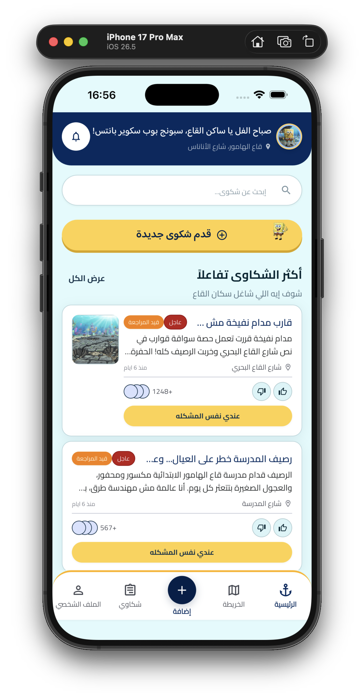
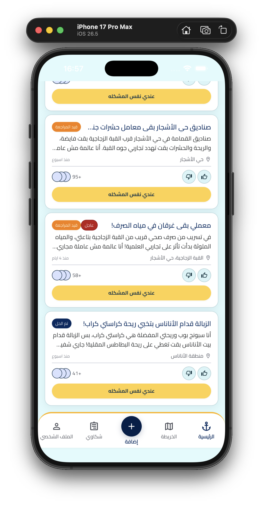

### Complaints

Shell tab `/complaints`. Filter chips (All / Mine / Resolved) over a scrollable card list.

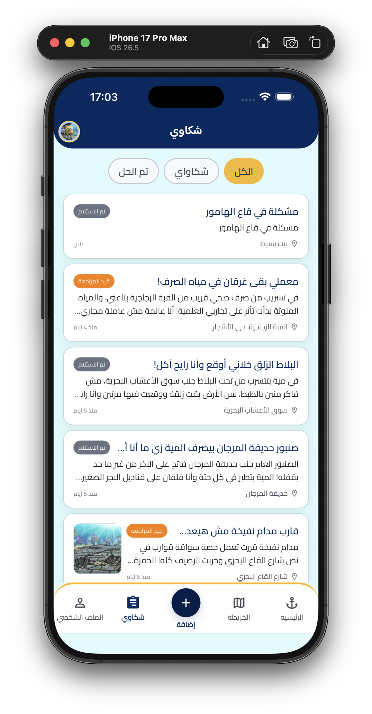

### Complaint details

Push route `/complaints/:id`. Status stepper, reactions, description, and comments thread with composer.

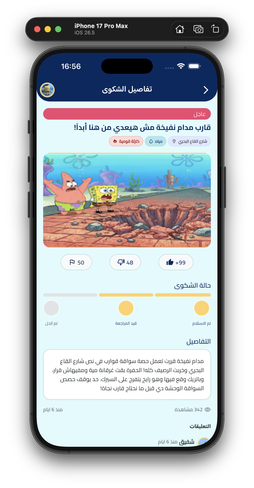
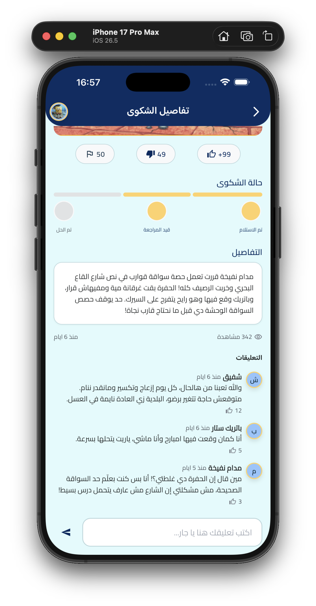

### Create complaint

Push route `/create-complaint`. One Cubit drives the whole wizard: **form** (photo, category, title, description, location, severity) → **review** (edit / cancel / submit) → **success**.

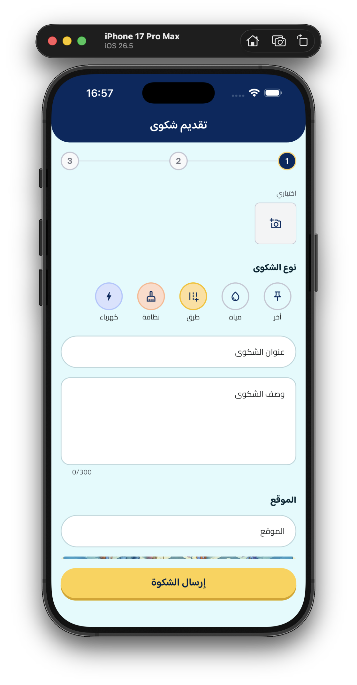
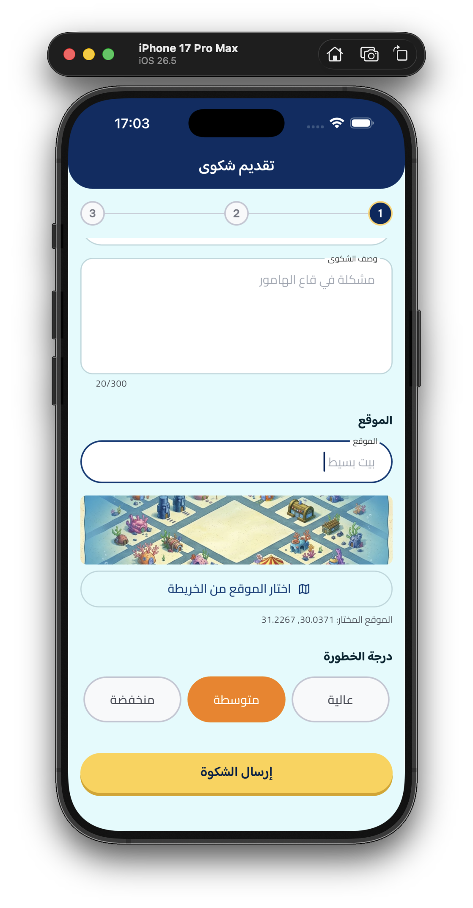
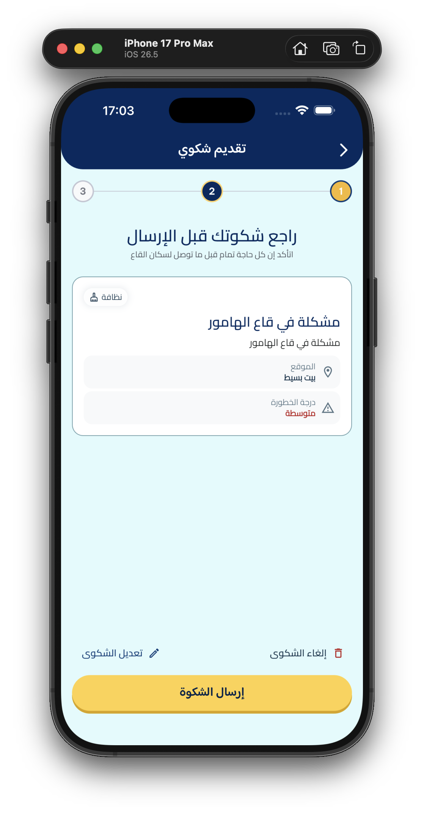
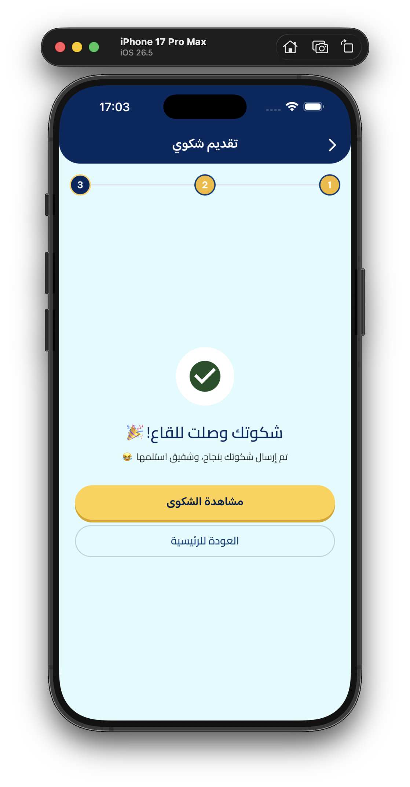

### Map

Shell tab `/map`. Interactive map with category pins; tapping a pin opens details.

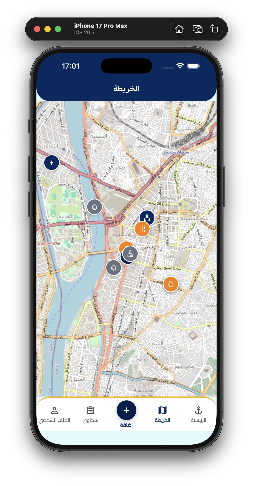

### Notifications

Push route `/notifications` (bell on Home and Profile). Filter chips for All / Complaints / Reactions / General.


### Profile

Shell tab `/profile`. Rank, bubble stats, settings. Language lives under Settings. Personal Info and Favorites are coming-soon SnackBars, not pages.

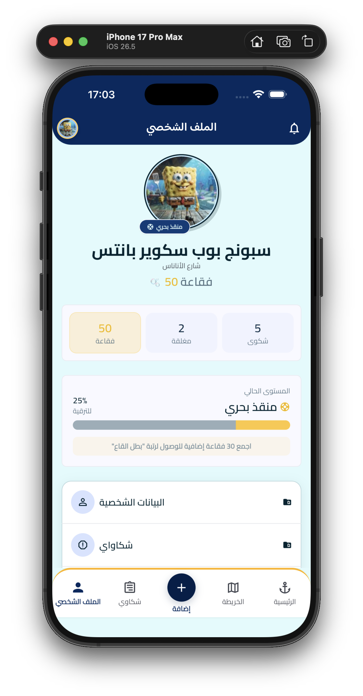

### My complaints

Push route `/profile/my-complaints` from the Profile menu. Status-badged list of the signed-in resident’s reports.


Login (`/login`) and register (`/register`) are implemented but not captured here. Splash (`/splash`) is a branded loading frame; auth redirect is handled by `GoRouter`, not by the splash widget itself.

---

## Demo

A walkthrough of the running app is in this repository:

**[docs/demo.mov](docs/demo.mov)** (~38 MB, QuickTime `.mov`)

GitHub does **not** reliably inline `.mov` (or most in-repo video files) inside a README. There is no Git LFS pointer and no external hosting URL for this clip. Open the file in the repo, or download it from GitHub’s file view.

Poster (links to the video file):

[](docs/demo.mov)

The original capture is also at [`Screens/0830.mov`](Screens/0830.mov).

---

## User flow

Routes match `flutter/lib/core/router/route_paths.dart` and `app_router.dart`.

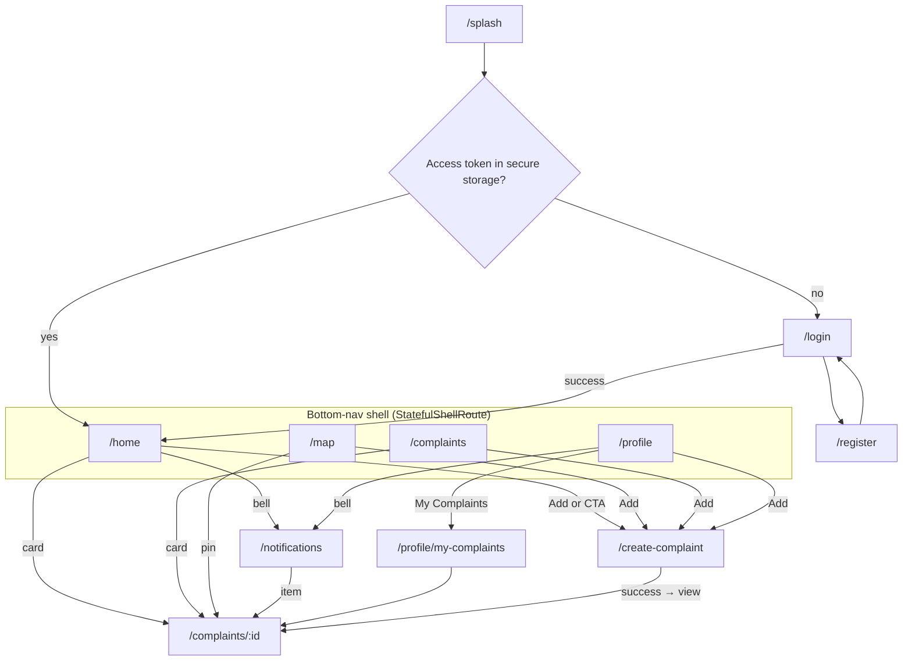

| Kind | Paths |
| --- | --- |
| **Auth / public** | `/splash` → `/login` or `/home`; `/register` |
| **Shell tabs** | `/home`, `/map`, `/complaints`, `/profile` |
| **Push (not a tab)** | `/create-complaint`, `/complaints/:id`, `/notifications`, `/profile/my-complaints` |

---

## Architecture

Feature-first **Clean Architecture** with three layers. There is **no Use Case layer** in this codebase: Cubits call repository contracts **directly**. Empty `usecases/` folders are not present; several features still have `.gitkeep` scaffolding under `data/` / `domain/` that is unused.

```
Presentation          Domain                         Data
pages, widgets,  →    entities +                     models, mappers,
Cubit                 repository interfaces    ←     remote data sources,
                                                     repository implementations
```

Dependency direction: **Presentation → Domain ← Data**. Domain does not import Dio, Hive, or Flutter widgets.

| Piece | How it is used here |
| --- | --- |
| **Cubit** (`flutter_bloc`) | One Cubit per screen (or one for the whole create-complaint wizard). Factory-registered in GetIt so state does not leak between visits. |
| **Repository** | Abstract contract in `domain/repositories`. Implementation in `data/repositories`, wrapping remote calls with `NetworkInfo` / `fpdart` `Either<Failure, T>`. |
| **Data sources** | Dio-backed remote sources (`AuthRemoteDataSource`, `ComplaintRemoteDataSource`, `NotificationRemoteDataSource`, `ProfileRemoteDataSource`). |
| **Models / mappers** | DTOs and JSON mapping in `data/`; domain entities stay UI- and JSON-agnostic. |
| **Entities** | Shared domain types such as `User`, `Complaint`, `Category`, `Comment`, `AppNotification`, `ProfileStats`. |
| **GetIt** | Manual composition root in `flutter/lib/core/di/injection.dart` (no `injectable` codegen). |

Home, Map, and Create Complaint do **not** own their own repositories. They inject `ComplaintRepository` and/or `AuthRepository`. Splash is presentation-only; session checks live in `GoRouter.redirect`.

---

## Tech stack

From `flutter/pubspec.yaml` (runtime and test dependencies that are actually declared):

| Layer | Packages |
| --- | --- |
| **UI / app** | Flutter 3.22+, Material, `google_fonts` (Baloo Bhaijaan 2, Cairo, and related styles in `app_typography.dart`) |
| **State** | `flutter_bloc`, `bloc`, `equatable` |
| **Routing** | `go_router` |
| **DI** | `get_it` |
| **Networking** | `dio`, `pretty_dio_logger`, `connectivity_plus` |
| **Errors** | `fpdart` (`Either`) |
| **Storage** | `flutter_secure_storage` (tokens), `hive` / `hive_flutter` (locale + cache init) |
| **Map / location** | `flutter_map`, `latlong2`, `geolocator`, `permission_handler` |
| **Media** | `image_picker`, `cached_network_image` |
| **l10n** | `flutter_localizations`, `intl` (ARB → generated `app_localizations*.dart`) |
| **Logging** | `logger` |
| **Testing** | `flutter_test`, `integration_test`, `bloc_test`, `mocktail`, `flutter_lints` |

Mock server: Node.js, `json-server` (`backend/mock-server/`).

---

## Localization

| Code | Direction | Source |
| --- | --- | --- |
| `ar` | RTL | `flutter/lib/l10n/app_ar.arb` (template) |
| `en` | LTR | `flutter/lib/l10n/app_en.arb` |
| `de` | LTR | `flutter/lib/l10n/app_de.arb` |

`AppLocaleCubit` holds the active `Locale`, defaults to Arabic, and persists the choice via `HiveLocaleSettingsStore`. Layout direction comes from Flutter’s localization delegates — there is no manual `Directionality` wrapper in `main.dart`. The language picker is Profile → Settings.

Generate bindings after ARB edits (from `flutter/`):

```bash
flutter gen-l10n
```

`l10n.yaml` writes output to `lib/l10n/` (`generate: true` in `pubspec.yaml`).

---

## Project structure

```
sout_el_qaa/
├── flutter/                    # Flutter app root (pubspec.yaml lives here)
│   ├── lib/
│   │   ├── main.dart
│   │   ├── bootstrap.dart      # Hive + GetIt + AppLocaleCubit.hydrate
│   │   ├── common/widgets/     # Cross-feature UI that is not infrastructure
│   │   ├── core/
│   │   │   ├── constants/      # API paths, AppConfig, map defaults
│   │   │   ├── di/             # GetIt composition root
│   │   │   ├── errors/
│   │   │   ├── locale/         # AppLocaleCubit
│   │   │   ├── network/        # Dio client, interceptors, NetworkInfo
│   │   │   ├── permissions/
│   │   │   ├── router/         # GoRouter + RoutePaths
│   │   │   ├── storage/        # Secure storage + Hive cache
│   │   │   ├── theme/
│   │   │   ├── utils/
│   │   │   └── widgets/        # Shared chrome (bottom nav, fields, badges)
│   │   ├── features/
│   │   │   ├── auth/
│   │   │   ├── complaints/
│   │   │   ├── create_complaint/
│   │   │   ├── home/
│   │   │   ├── map/
│   │   │   ├── notifications/
│   │   │   ├── profile/
│   │   │   └── splash/
│   │   └── l10n/               # ARB + generated AppLocalizations
│   ├── test/                   # Unit / widget / Cubit tests
│   ├── integration_test/       # app_walkthrough_test.dart
│   ├── ios/                    # Xcode project
│   └── assets/images/
├── backend/
│   └── mock-server/            # json-server mock of /api/v1
├── docs/
│   ├── screenshots/            # README captures
│   └── demo.mov
└── README.md
```

Typical feature layout (auth, complaints, notifications, profile):

```
features/<name>/
├── data/
│   ├── datasources/
│   ├── mappers/
│   ├── models/
│   └── repositories/           # *RepositoryImpl
├── domain/
│   ├── entities/
│   └── repositories/           # abstract *Repository
└── presentation/
    ├── cubit/
    ├── pages/
    └── widgets/
```

---

## Installation

### Requirements

- Flutter **≥ 3.22** and Dart **≥ 3.4** (see `flutter/pubspec.yaml`)
- Node.js (for the mock server)
- An iOS Simulator (the `flutter/ios/` project is in the repo). Android: the `android/` folder is **not** checked in; generate it from `flutter/` with `flutter create --platforms=android .` if you need an Android build. That command adds platform files and does not replace `lib/` or `pubspec.yaml`.

### 1. Mock server

```bash
cd backend/mock-server
npm install
npm start
```

Listens on **http://localhost:3000**. This is development tooling only (fake tokens, placeholder media URLs, json-server query semantics). Details: [`backend/mock-server/README.md`](backend/mock-server/README.md).

### 2. Flutter app

All Flutter commands run from **`flutter/`**, not the monorepo root.

```bash
cd flutter
flutter pub get
flutter gen-l10n
flutter run --dart-define=API_BASE_URL=http://localhost:3000
```

`API_BASE_URL` defaults to `http://localhost:3000` in `AppConfig` if you omit `--dart-define`. Endpoint paths always include the `/api/v1` prefix (`ApiEndpoints`).

### Demo account

| | |
| --- | --- |
| **Email** | `spongebob@qaa-el-hamour.eg` |
| **Password** | `qaaHamour1` |

The mock server also accepts **`resident@qaa-el-hamour.eg`** as an alias for the same resident.

### Tooling note (exFAT)

If the working copy lives on an exFAT volume, macOS may create `._*` AppleDouble sidecar files. They are gitignored (`._*` in `.gitignore`) and are not part of the app.

---

## Testing

From `flutter/`:

```bash
flutter test
```

| Kind | Location | Notes |
| --- | --- | --- |
| **Unit / Cubit** | `flutter/test/core/`, `flutter/test/features/` | Validators, error mapping, locale Cubit, layout direction, `AuthCubit`, `ComplaintDetailsCubit`, `CreateComplaintCubit`. Uses `bloc_test` and `mocktail`. |
| **Integration walkthrough** | `flutter/integration_test/app_walkthrough_test.dart` | Drives Home → details → notifications → map → create → complaints → profile → my complaints on a simulator. Used for visual capture (`SCREEN:<name>` markers), not a large `expect()` suite. |

Run the walkthrough (device or simulator required):

```bash
cd flutter
flutter test integration_test/app_walkthrough_test.dart
```

Static checks used in this project:

```bash
cd flutter
dart format .
flutter analyze
```

---

## Code quality

- **Clean Architecture** with a real presentation / domain / data split where features own their data (auth, complaints, notifications, profile). Cubits never call Dio.
- **Cubit** for screen state; sealed/union-style states (or a single state object with status) instead of ad-hoc booleans.
- **Repository contracts** in domain; implementations guard network I/O and map failures to `Failure` + l10n message keys.
- **GetIt** as an explicit composition root (factories for Cubits, singletons for I/O).
- **l10n** for user-visible strings (ARB keys, not hardcoded copy in widgets), with RTL/LTR covered by Flutter locale + widget tests under `test/core/widgets/locale_layout_test.dart` and `test/core/locale/`.
- **Analyzer** uses `flutter_lints` plus strict casts/inference/raw types (`flutter/analysis_options.yaml`).

---

## Design and product concept

Sout El-Qaa is designed as a **municipal complaints client**: navy chrome, gold CTAs, status color, card lists, and a map of open issues. The setting is Qaa El Hamour — pineapple street, coral gardens, familiar residents — so the copy and illustration can stay playful without turning the product into a joke app.

Typography uses **Baloo Bhaijaan 2** and **Cairo** (via `google_fonts`) with Arabic-first metrics. The bottom navigation uses an anchor for Home rather than a generic house icon. Character avatars and complaint photos are bundled under `flutter/assets/images/`.

The Figma source and the longer implementation plan live in-repo as working documents (`PLAN.md`, audit reports). This README describes **what the current `feature/sandy` tree actually runs**.
