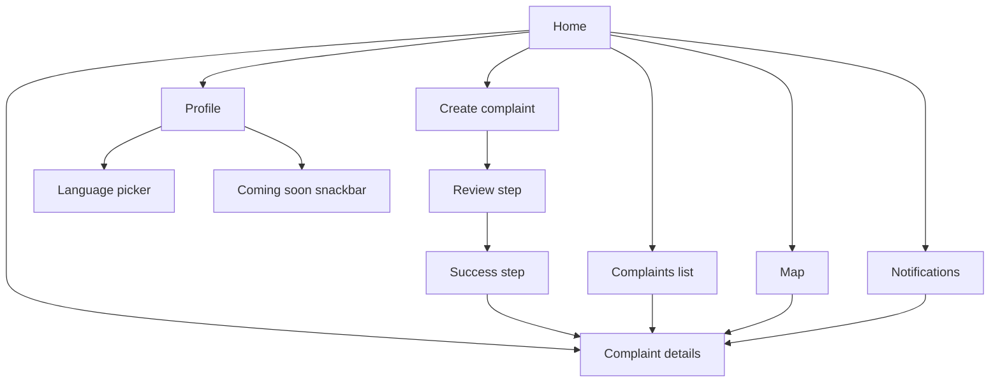

# Sout El-Qaa (صوت القاع)

A civic complaints app for residents of **Qaa El Hamour** (قاع الهامور) — a Bikini Bottom–themed neighborhood presented as a municipal reporting product. Residents browse community issues, submit complaints, track status, react, comment, and explore reports on a map.

This README is a **visual walkthrough** based on the screenshots and demo recordings in [`Screens/`](Screens/). It documents only what those assets show.

| | |
| --- | --- |
| **Platform** | Flutter (iOS simulator captures) |
| **Languages shown** | English (LTR) and Arabic (RTL) |
| **Visual assets** | 17 screenshots + 2 demo videos in `Screens/` |

---

## Table of contents

1. [Overview](#overview)
2. [Features visible in captures](#features-visible-in-captures)
3. [Demo videos](#demo-videos)
4. [User flow](#user-flow)
5. [Screens](#screens)
6. [Limitations](#limitations)

---

## Overview

Sout El-Qaa is a neighborhood complaints client with navy chrome, gold call-to-action buttons, and card-based feeds. The captures show a signed-in resident (SpongeBob SquarePants) using the app on an iPhone simulator.

Core areas visible in the assets:

- **Home** — greeting, search, trending complaints, and a submit-complaint CTA
- **Complaint details** — status tracking, reactions, comments, and media
- **Complaints list** — filterable feed (All / Mine / Resolved)
- **Map** — geolocated complaint pins by category
- **Create complaint** — three-step wizard (form → review → success)
- **Notifications** — filtered activity feed
- **Profile** — rank, stats, settings, and menu items

---

## Features visible in captures

| Area | What the screenshots show |
| --- | --- |
| **Home** | Personalized greeting, location line (“Qaa El Hamour, Pineapple Street”), search field, yellow **Submit New Complaint** button, **Most Engaged Complaints** feed with status tags (Urgent, In Review, Resolved), reaction counts, and **I have the same problem** CTA |
| **Complaint details** | Title, category/location/severity tags, photo attachment, like / dislike / report counters, three-step status bar (Received → In Review → Resolved), description, view count, timestamp, and comments thread with composer |
| **Complaints list** | Filter chips **All**, **Mine**, **Resolved**; cards with status badges, Arabic and English titles, location pins, timestamps, and optional thumbnails |
| **Map** | Interactive street map with color-coded category pins (electricity, water, roads, cleanliness, other) |
| **Create complaint** | Step 1: optional photo, category icons (كهرباء، نظافة، طرق، مياه، أخرى), title, description (300-char limit), location, severity. Step 2: review card with edit/cancel. Step 3: success screen with **View Complaint** and **Back to Home** |
| **Notifications** | Filters: All / Complaints / Reactions / General; items for comments, status updates, resolutions, and welcome message; **Mark all as read** action |
| **Profile** | Avatar, **Sea Rescuer** rank, bubble points, complaint/closed stats, progress toward next rank, menu rows (Personal Info, My Complaints, Favorites, Settings, Log Out) |
| **Localization** | Language sheet with Arabic, English, and Deutsch; Arabic RTL complaints list capture |

---

## Demo videos

Full walkthrough recordings are in [`Screens/`](Screens/):

| File | Size | Description |
| --- | --- | --- |
| [`Screens/demo english.mov`](Screens/demo%20english.mov) | ~32 MB | English UI walkthrough |
| [`Screens/demo arabic.mov`](Screens/demo%20arabic.mov) | ~31 MB | Arabic UI walkthrough |

GitHub does not reliably inline `.mov` files in README previews. Open or download the files from the links above.

---

## User flow

Flow implied by the screenshot sequence and demo videos:

| Navigation | Visible in captures |
| --- | --- |
| **Bottom tabs** | Home (anchor), Map, Add (+), Complaints, Profile |
| **Push screens** | Complaint details, Create complaint (3 steps), Notifications |
| **Profile menu** | Personal Info, My Complaints, Favorites, Settings, Log Out |

The center **Add** button and home CTA both lead into the create-complaint wizard shown in the captures.

---

## Screens

All images below live in [`Screens/`](Screens/). Paths are relative to the repository root.

### Home

Greeting, search, submit CTA, and trending complaint cards. Second capture shows additional feed cards with status tags and engagement actions.

### Complaint details

Status stepper, reactions, description, and comments on an existing report; then a newly submitted complaint at **Received** status.

### Map

Map tab with category-colored pins over a street map.

### Create complaint

Three-step wizard: form, review, and success.

### Complaints list

Filter chips **All**, **Mine**, and **Resolved** over a scrollable card list. Arabic RTL variant shown in a separate simulator capture.

### Notifications

Filtered notification feed with comment, status, resolution, and welcome items.

### Profile

Rank, bubble stats, progress bar, and settings menu. Language picker and a coming-soon snackbar are also captured.

---

## Limitations

This README reflects **only** the 17 PNG screenshots and 2 `.mov` demo files in [`Screens/`](Screens/). It does not describe backend setup, architecture, or code structure.

**Not shown in the Screens folder:**

- Login, register, and splash screens
- **My Complaints** as a dedicated list page (menu row is visible; list screen is not captured)
- German UI beyond the language picker label
- Map pin tap → details transition (map is shown; pin interaction is not)

**Partially shown:**

- **Personal Info** and **Favorites** menu rows appear, but tapping them shows a “Still setting this page up… check back soon” snackbar rather than a full screen.

For implementation details, see `flutter/`, `backend/mock-server/`, and other in-repo docs.
