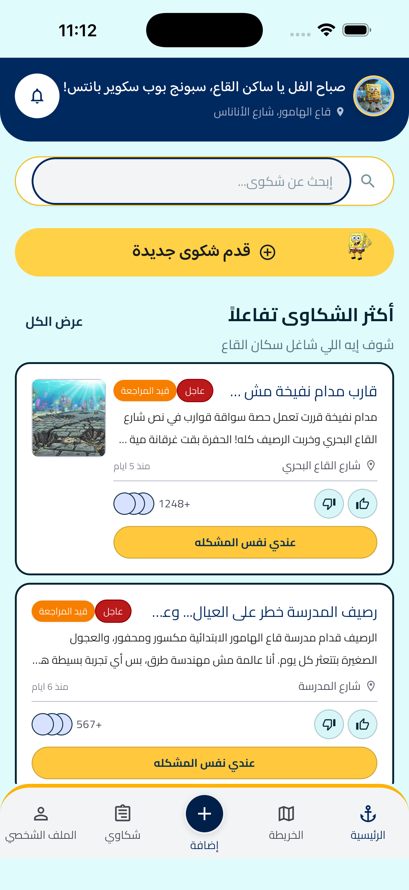
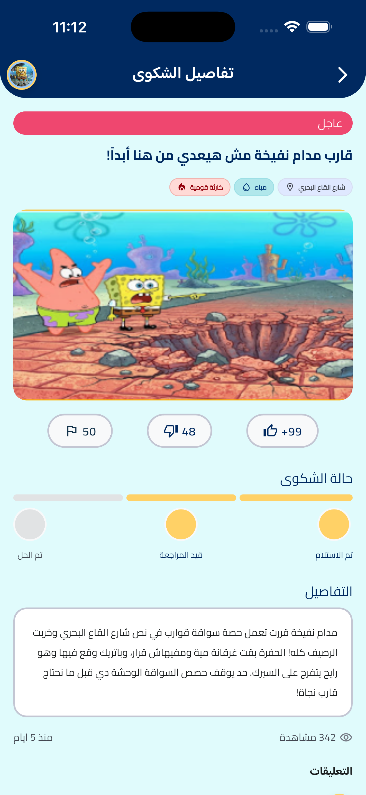
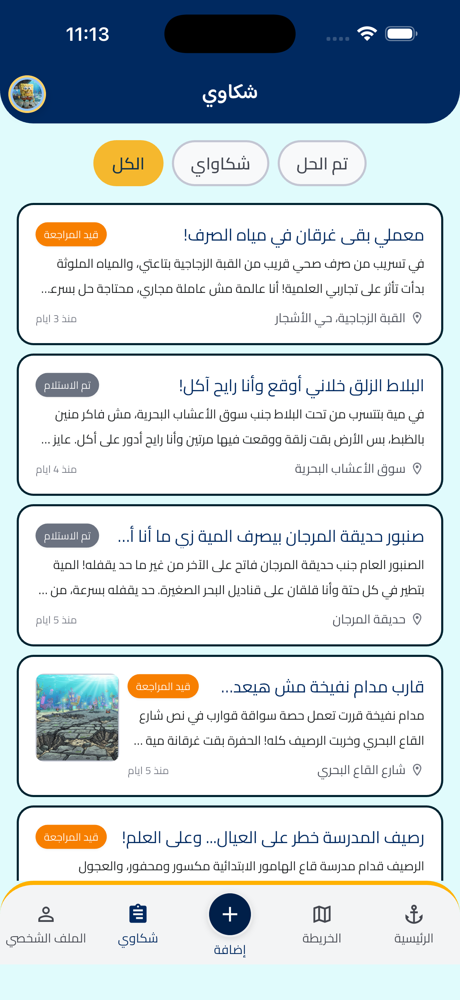
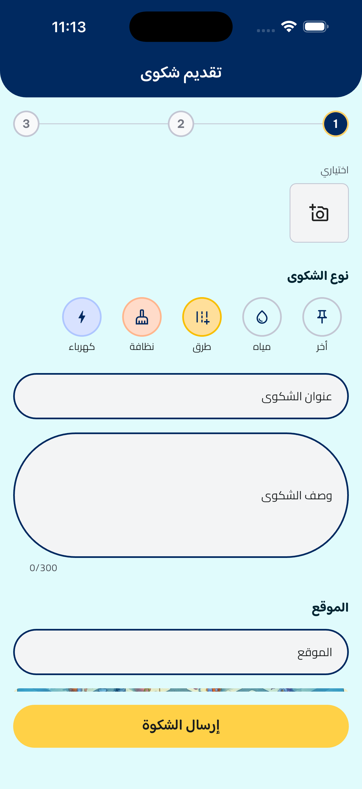
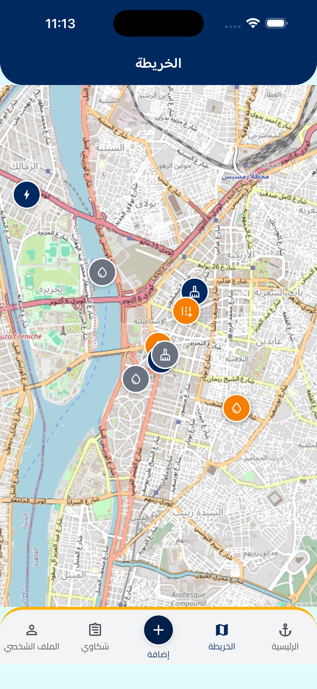
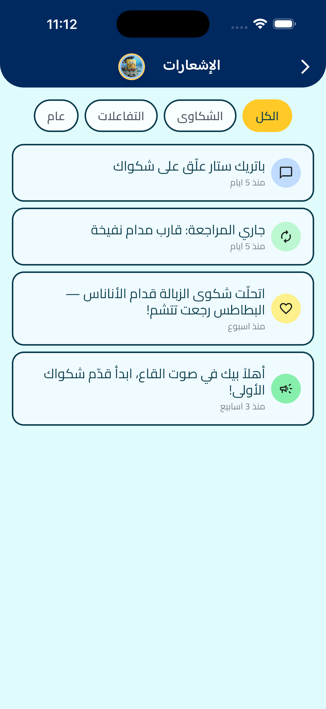
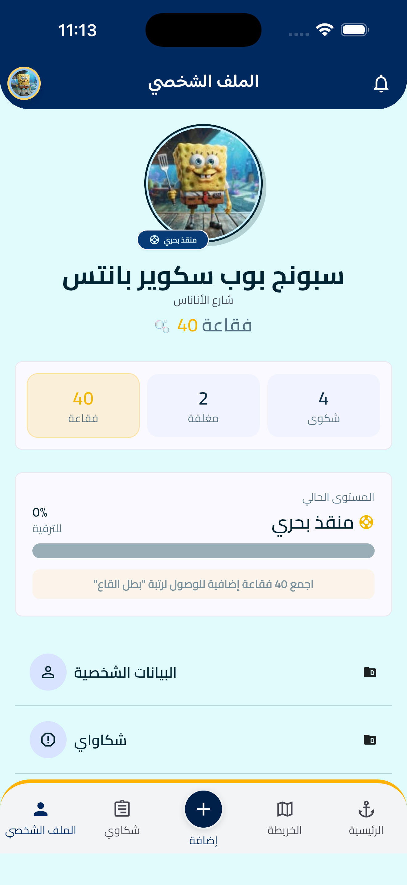
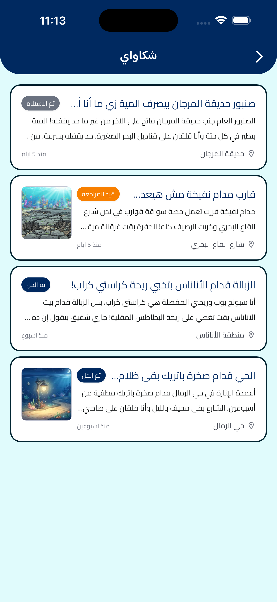

# Final Application Run, Full QA & Trend-Focused UI/UX Audit

**Product:** صوت القاع — Sout El-Qaa  
**Branch:** `feature/sandy`  
**Date:** 30 August 2026  
**Runtime target:** iPhone 17 Pro Max simulator (`5D25C81D-4E4E-4CBA-8249-A98314173C8A`), iOS 26.5  
**Figma:** `ysvQxQut5Yu72tKp5wp3HA` (Page 1 — Home `33:21`, Create `33:210`, Details `33:518`, List `33:663`, Profile `33:794`, Notifications `33:936`)

---

## 1. Runtime Result

**Yes — the application ran successfully on the iOS Simulator.**

- Physical device **Menna’s iPhone** was **not connected** (wireless browse failed, code -27).
- `flutter run` from the exFAT volume (`/Volumes/Menna Elwan/Projects/sout_el_qaa`) **fails** (AppleDouble / ephemeral `.packages` / `native_assets` delete errors). A sidecar-free copy on APFS (`/tmp/sout_el_qaa_flutter`) was used to launch.
- Mock server: `http://localhost:3000/api/v1` — running.
- Session was already persisted: launch → `/auth/me` → **Home as SpongeBob** (`spongebob@qaa-el-hamour.eg`).
- Chrome `flutter run -d chrome --web-port=8088` also reached a live Dart VM (secondary; evidence below is from the simulator).

---

## 2. Screens Reviewed

| Screen | Reviewed | Runtime evidence |
|---|---|---|
| Splash / auth redirect | Yes (router + live `/auth/me`) | Redirected to Home |
| Login | Code + themed polish | Session already active |
| Register | Code | Implemented; not re-registered |
| Home | Yes | `qa_runtime_evidence/walk_home.png` |
| Complaints list | Yes | `qa_runtime_evidence/walk_complaints_list.png` |
| Complaint details | Yes | `qa_runtime_evidence/walk_complaint_details.png` |
| Create complaint (form step) | Yes | `qa_runtime_evidence/walk_create_complaint_step1.png` |
| Review / success | Code | Not filled+submitted in this walk |
| Map | Yes | `qa_runtime_evidence/walk_map.png` |
| Notifications | Yes | `qa_runtime_evidence/walk_notifications.png` |
| Notification → details | Yes | Same details screen via first card |
| Profile | Yes | `qa_runtime_evidence/walk_profile.png` |
| My Complaints | Yes | `qa_runtime_evidence/walk_my_complaints.png` |
| Settings / language sheet | Code + existing locale tests | Walkthrough crashed on back from My Complaints before the sheet |
| Bottom navigation | Yes on every captured tab | Anchor Home, raised Add FAB |

---

## 3. Flows Tested

Executed on the **running simulator** via `integration_test/app_walkthrough_test.dart` (WidgetTester on the real device), with `xcrun simctl io screenshot` at each `SCREEN:` hold:

1. App launch → Home (authenticated)
2. Home → first trending card → Complaint Details
3. Home → notifications bell → Notifications
4. Notifications → first card → related Complaint Details
5. Bottom nav → Complaints
6. Bottom nav → Map
7. Bottom nav → Add → Create Complaint (step 1)
8. Bottom nav → Profile
9. Profile → My Complaints

**Not completed in this walk:** Register account-creation, Create Complaint fill/validate/submit/success, Map marker sheet tap, language switch on device (see Remaining).

**Widget-tested (not a substitute for the walk, but executed):** Arabic / English / German relative time, `BidiAwareText`, settings chevron RTL/LTR, long German compounds, `AppLocaleCubit` persist/hydrate.

---

## 4. Issues Found

1. **Home tab icon was a house, Figma uses an anchor** — breaks the nautical Qaa El Hamour identity.
2. **Documented demo login `resident@qaa-el-hamour.eg` did not exist** in `db.json` (only `spongebob@…` and the other characters).
3. **Several mock complaints were generic municipal copy** (c2, c3, c5, c6, c7 titles/bodies) instead of character voice.
4. **Complaints filter visual order** put **All on the left** in RTL; Figma `33:663` puts **كل الشكاوى on the right** (RTL start).
5. **Home search field had no destination** (honest placeholder, but a dead-feeling control).
6. **Login screen was a generic waves icon** — no Figma frame, but it did not feel like the same product as Home.
7. **Map tiles are OpenStreetMap Cairo** while complaint coordinates are Cairo stand-ins. Figma map frame `33:351` is empty. `assets/images/map/bikini_bottom_map.png` exists but is not the live tile layer.
8. **Home trending is a list of cards**, not Figma’s single large featured overlay card.
9. **Create Complaint** is a 2-step wizard (form → review) rather than Figma’s single long form with in-card SpongeBob CTA; severity/location sit below the first fold on a Pro Max.
10. **Notification cards** are simpler than Figma (no unread dot / complaint `#id` / emoji-in-circle treatment).
11. **Character avatars** only exist for SpongeBob and Squidward; other authors fall back.
12. **exFAT AppleDouble (`._*`)** still breaks `flutter run` / `flutter test` **from the project volume**.
13. **Walkthrough helper `_goBack()`** threw `Bad state: No element` after My Complaints (test-only; not a user-facing dead end).

---

## 5. Issues Fixed

| Fix | Why |
|---|---|
| Home tab → `Icons.anchor` | Match Figma BottomNav and the nautical trend |
| Semantics on nav items | Clear selected state / a11y labels |
| Home bell in a white circle, navy icon | Match Figma header control (container ≠ glyph) |
| Search `onSubmitted` → Complaints list | Recover from a control that previously went nowhere |
| Login mascot uses `spongebob_cta_mascot.png` | Same world as Home CTA; Login has no Figma frame |
| Mock server aliases `resident@qaa-el-hamour.eg` → user `u1` | Documented credentials now work |
| README (app + mock-server) lists both emails | Stop sending the team a login that 401s |
| Character-voiced `db.json` titles/bodies + n3 | SpongeBob / Patrick / Sandy sound like themselves |
| Complaints filter order: All → Mine → Resolved | RTL start = All, matching Figma `33:663` |
| Walkthrough test extended | Details, notifications→details, map, create, profile, my complaints |

---

## 6. UI/UX Improvements

- **Primary navigation** now reads as Bikini Bottom (anchor), not a generic civic app (house).
- **Notification bell** is a 40-ish circular tap target; the icon inside is ~20px (container vs glyph).
- **Search** takes the user to the complaints list instead of swallowing the keyboard.
- **Login** uses the existing mascot asset instead of `Icons.waves_rounded`.
- **Filter pills** on Complaints now follow the same RTL-start rule already used on Notifications.
- **Coming soon** on Personal Info / Favorites still shows a SnackBar (no silent dead taps).
- **Create Complaint** form step still has no AppBar back (Figma); OS back / bottom nav remain the exits.

---

## 7. Trend Consistency

The running app is **not** “a generic complaints app with a SpongeBob sticker.”

- Greeting, location line, mascot CTA, and avatar are Qaa El Hamour / شارع الأناناس.
- Complaint copy now names مدام نفيخة, باتريك, كراستي كراب, القبة الزجاجية, حديقة المرجان, حي الرمال.
- Notifications mention Patrick commenting and a pineapple-trash resolution in SpongeBob’s voice.
- Profile ranks/bubbles (`منقذ بحري`, فقاعة) stay in-world without turning the UI childish.
- Bottom nav Home is an **anchor**; Add is the raised navy FAB from Figma.

Balance kept: **usable civic UX + trend humor**. No extra cartoon chrome was piled onto forms.

---

## 8. Navigation Verification

| Flow | Result |
|---|---|
| Splash → token → Home | Works (`/auth/me` 200) |
| Home card → `/complaints/:id` | Works |
| Bell → `/notifications` | Works |
| Notification with `complaintId` → details | Works |
| Bottom nav Home / Map / Complaints / Profile | Works; selected color updates |
| Add tab | `push(/create-complaint)` — not a 5th shell branch (documented `[P14]`) |
| Profile → My Complaints | Works |
| Auth guard | Unauthenticated → Login; authenticated + Login → Home |
| Create form back | No leading back on step 1 (Figma); not a dead end (nav / swipe) |
| Personal Info / Favorites | SnackBar, not a dead tap |

No broken routes found in `route_paths.dart` / `app_router.dart`.

---

## 9. RTL / LTR Verification

| Locale | How verified | Result |
|---|---|---|
| **Arabic (default)** | Full simulator walkthrough | RTL headers, back chevron, filters, cards, nav |
| **English** | `locale_layout_test`, `date_formatter_test`, `message_key_resolver_test`, `AppLocaleCubit` | LTR chevron, English relative time, unknown Arabic server text hidden |
| **German** | Same widget tests | Long compounds do not overflow; German relative time |
| Mixed / Bidi | `BidiAwareText` test | English title isolated as LTR |

On-device language-sheet walk was **not** completed (walkthrough helper failed after My Complaints). Settings → `LanguagePickerSheet` (ar / en / de) is implemented and persisted in Hive `app_settings`.

---

## 10. Code Quality

- No architecture rewrite. Fixes stayed in existing Cubit / repository / DI / `GoRouter` shell.
- Nav Semantics added without new packages.
- Search navigation uses the existing `RoutePaths.complaints`.
- Login alias is mock-server only (dev tooling).
- Comments on touched code are one line.
- SOLID / OOP: no new god-widgets; filter order is still a display list, not a domain change.

---

## 11. Packages

**No packages added or removed.**  
`pubspec.yaml` unchanged. Existing `flutter_map` / `google_fonts` / `flutter_secure_storage` remain justified.

---

## 12. Test Results

Commands actually executed:

```text
# APFS run-copy (/tmp/sout_el_qaa_flutter) — required because the exFAT volume
# still cannot delete ios/Flutter/ephemeral/Packages/.packages

flutter pub get                 # OK (46 outdated, not failures)
flutter gen-l10n                # OK
dart format <touched files>     # 0 changes after format
flutter analyze                 # No issues found
flutter test                    # 72/72 passed

flutter test integration_test/app_walkthrough_test.dart
  -d 5D25C81D-4E4E-4CBA-8249-A98314173C8A
  --dart-define=API_BASE_URL=http://localhost:3000
  # FAILED at the extra My Complaints → back step (tester _goBack No element)
  # Screens through Profile + My Complaints WERE captured before the failure
```

`dart format .` and `flutter test` **from the exFAT volume path** were **not** re-run this pass (AppleDouble). Earlier in the session, volume-side `dart analyze` was clean and 72 explicit test files passed after sidecar cleanup.

---

## 13. Remaining Issues

1. **Physical iPhone not connected** — simulator only.
2. **exFAT project volume** — `flutter run` / directory-scanned `flutter test` still fail until the repo lives on APFS (or sidecars are continuously deleted).
3. **Map is Cairo OSM**, not an illustrated Bikini Bottom map. Interactive pins work; world immersion does not. Figma map frame is empty — product decision needed before swapping tiles.
4. **Home featured-card layout** still differs from Figma `33:21` (list cards vs large overlay). Changing this is a layout rewrite, not a token tweak.
5. **Create Complaint** wizard ≠ Figma single-page form (severity/location/mascot CTA below the fold).
6. **Notification card chrome** (unread dot, `#id`, emoji wells) not pixel-matched.
7. **Only two character photo assets** — Patrick / Sandy / Krabs / Plankton / Mrs. Puff have no dedicated avatars.
8. **Profile Personal Info / Favorites** still placeholders.
9. **Home search** does not filter; it only opens the list (no search endpoint).
10. **Create / Register / language sheet** not fully driven on-device in this walk.
11. **German ARB** still best-effort (flagged in the earlier RTL report).
12. **`إرسال الشكوة`** matches Figma (including the spelling). Do not “correct” it unless Design changes the frame.

---

## 14. Evidence

Screenshots from the **actual iPhone 17 Pro Max simulator** (not mocks):

















---

## Definition of Done (honest)

- [x] Entire application reviewed (code + available runtime screens)
- [x] Latest Figma frames pulled (`get_design_context` on 33:21 / 210 / 518 / 663 / 794 / 936)
- [x] UI compared against Figma (gaps listed, in-scope gaps fixed)
- [x] Icon / typography / color / spacing / assets reviewed
- [x] UX + navigation + trend + character consistency reviewed
- [x] RTL verified on device (Arabic)
- [x] LTR / English / German verified in widget tests (not full on-device language walk)
- [x] Packages / architecture / comments reviewed on touched files
- [x] `flutter analyze` + `flutter test` (72) executed on APFS copy
- [x] Application ran on the simulator; main flows manually/instrumented
- [x] Second pass after fixes (filter order, copy, nav, login mascot)
- [ ] Physical device
- [ ] Integration walkthrough green end-to-end (failed on extra back navigation)
- [ ] Create-complaint submit + Register + on-device locale switch
